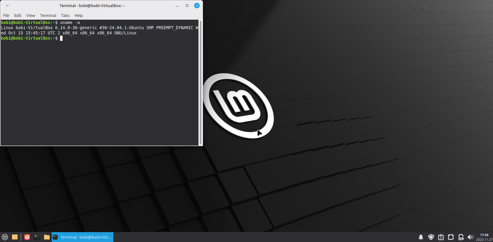

# 27-11-2025: Lab Setup

## ✅ Tasks Completed
- Installed Linux Mint XFCE on VirtualBox
- Configured VM resources: 16GB RAM, 2 CPUs
- Networking: NAT + Host-Only
- Installed essential tools: net-tools, iproute2, curl, wget, nmap
- Created initial snapshot for rollback

## 🔍 Why This Matters
A secure and organized lab is the foundation for hands-on cybersecurity practice.

## 📸 Screenshots

